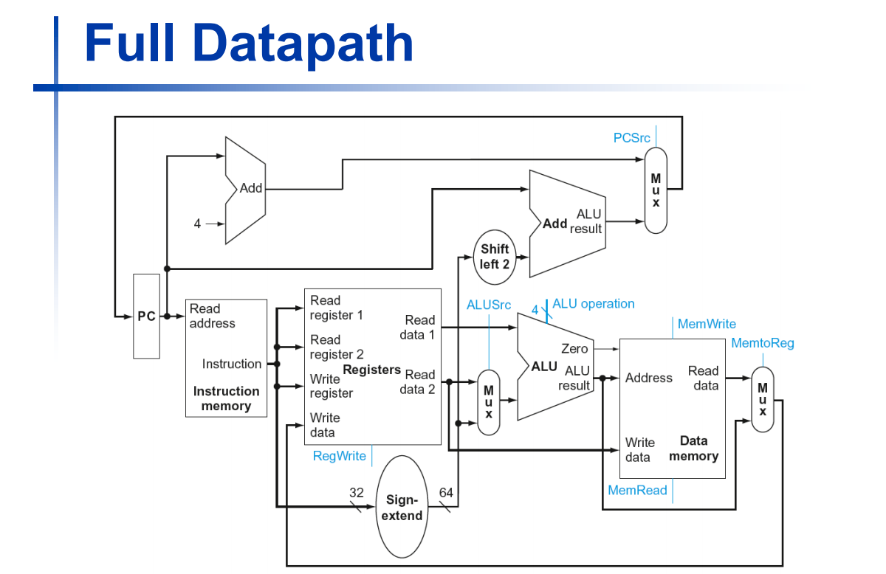
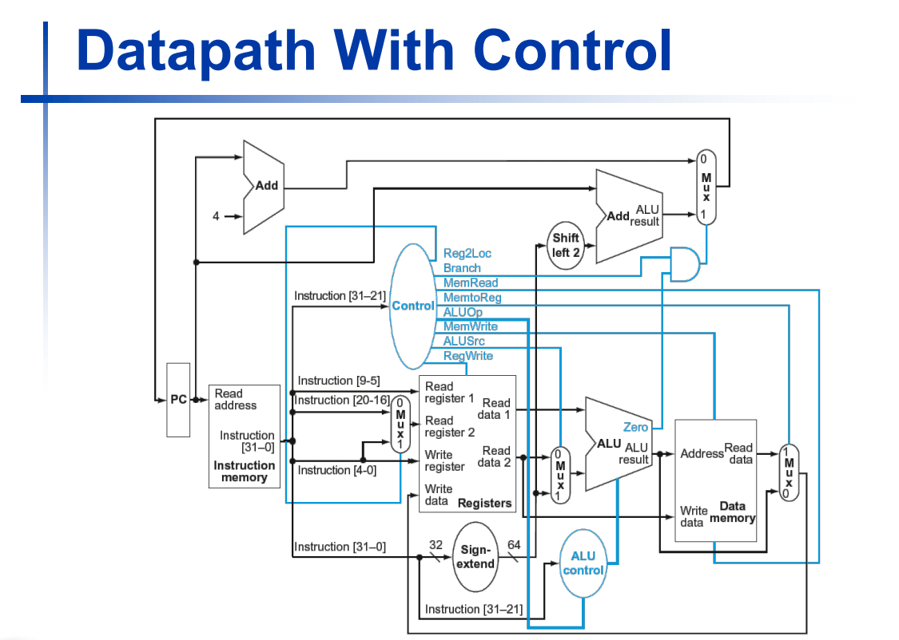

# ARM-LEGv8 simulator

A pipelined ARM LEGv8 CPU written in Verilog.

LEGv8 is subset of ARM instruction set.

Supported instructions include: LDUR, STUR, ADD, SUB, ORR, AND and CBZ.

For a brief introduction to what this project is all about and how different modules work, please look at the slides [here.](http://harmanani.github.io/classes/csc320/Notes/ch04.pdf)

To summarize, the full datapath without pipelining looks like :

With introduction of pipeline :

The data memory has been initialized as follows : 

	   Data[0]  = 64'h0000000000000000;
	   Data[8]  = 64'h1111111111111111;
	   Data[16] = 64'h2222222222222222;
	   Data[24] = 64'h3333333333333333;
	   Data[32] = 64'h4444444444444444;
	   Data[40] = 64'h5555555555555555;
	   Data[48] = 64'h6666666666666666;
	   Data[56] = 64'h7777777777777777;
	   Data[64] = 64'h8888888888888888;
	   Data[72] = 64'h9999999999999999;
	   Data[80] = 64'haaaaaaaaaaaaaaaa;
	   Data[88] = 64'hbbbbbbbbbbbbbbbb;
	   Data[96] = 64'hcccccccccccccccc;

How an LDUR instruction works : 

	LDUR X1, [X31, #8]
This instruction will load to X1 the value pointed by X31 plus 8 bytes. This is what we mean by byte offset. In our case the X31 register holds the value *64'h00000000* or *0x00* (See *RegisterFile.v*). This will load the value stored at address 0x08. The value of X31 will not be modified. We can see that the data memory holds the value *64'h1111111111111111* at the 8th register from the table above :

	Data[8]  = 64'h1111111111111111;
So this will load the value *64'h1111111111111111* to our X1 register. 

We initialize our instruction memory with some values that correspond to various instructions that we want to perform. 
They are as follows :

       //Load Operations
        
        //LDUR X1, [X31, #8]
        //Data[0-3] = 'b11111000;010_00000;1000_00_11;111_00001
        Data[0] = 'b11111000; //'hf8
        Data[1] = 'b01000000; //'h40
        Data[2] = 'b10000011; //'h83
        Data[3] = 'b11100001; //'he1
        
        //LDUR X2, [X31, #16]
        //Data[4-7] = 'b11111000;010_00001;0000_00_11;111_00010
        Data[4] = 'b11111000; //'hf8
        Data[5] = 'b01000001; //'h41
        Data[6] = 'b00000011; //'h03
        Data[7] = 'b11100010; //'he2
        
        //LDUR X3, [X31, #24]
        //Data[8-11] = 'b11111000;010_00001;1000_00_11;111_00011
        Data[8] = 'b11111000; //'hf8
        Data[9] = 'b01000001; //'h41
        Data[10] = 'b10000011; //'h83
        Data[11] = 'b11100011; //'he3
        
        //LDUR X4, [X31, #32]
        //Data[12-15] = 'b11111000;010_00010;000_00_11;111_00100
        Data[12] = 'b11111000; //'hf8
        Data[13] = 'b01000010; //'h42
        Data[14] = 'b00000011; //'h03
        Data[15] = 'b11100100; //'he4
        
        //LDUR X5, [X31, #40]
        //Data[16-19] = 'b11111000;010_00010;1000_00_11;111_00101
        Data[16] = 'b11111000; //'hf8
        Data[17] = 'b01000010; //'h42
        Data[18] = 'b10000011; //'h83
        Data[19] = 'b11100101; //'he5
        
        //LDUR X6, [X31, #48]
        //Data[20-23] = 'b11111000;010_00011;0000_00_11;111_00110
        Data[20] = 'b11111000; //'hf8
        Data[21] = 'b01000011; //'h43
        Data[22] = 'b00000011; //'h03
        Data[23] = 'b11100110; //'he6
        
        //LDUR X7, [X31, #56] 
        //Data[24-27] = 'b11111000;010_00011;1000_00_11;111_00111
        Data[24] = 'b11111000; //'hf8
        Data[25] = 'b01000011; //'h43
        Data[26] = 'b10000011; //'h83
        Data[27] = 'b11100111; //'he7
        
	    //LDUR X8, [X31, #64] 
        //Data[28-31] = 'b11111000;010_00100;0000_00_11;111_01000
        Data[28] = 'b11111000; //'hf8
        Data[29] = 'b01000100; //'h44
        Data[30] = 'b00000011; //'h03
        Data[31] = 'b11101000; //'he8
        
        //LDUR X9, [X31, #72] 01001000
        //Data[32-35] = 'b11111000;010_00100;1000_00_11;111_01001
        Data[32] = 'b11111000; //'hf8
        Data[33] = 'b01000100; //'h44
        Data[34] = 'b10000011; //'h83
        Data[35] = 'b11101001; //'he9
        
        //LDUR X10, [X31, #80] 01001000
        //Data[36-39] = 'b11111000;010_00101;0000_00_11;111_01010
        Data[36] = 'b11111000; //'hf8
        Data[37] = 'b01000101; //'h45
        Data[38] = 'b00000011; //'h03
        Data[39] = 'b11101010; //'hea
        
        //LDUR X11, [X31, #88] 01011000
        //Data[40-43] = 'b11111000;010_00101;1000_00_11;111_01011
        Data[40] = 'b11111000; //'hf8
        Data[41] = 'b01000101; //'h45
        Data[42] = 'b10000011; //'h83
        Data[43] = 'b11101011; //'heb
        
        //LDUR X12, [X31, #96] 0110 0000
        //Data[44-47] = 'b11111000;010_00110;0000_00_11;111_01100
        Data[44] = 'b11111000; //'hf8
        Data[45] = 'b01000110; //'h46
        Data[46] = 'b00000011; //'h03
        Data[47] = 'b11101100; //'hec
        
        

       
        // Arithmetic Operations
        
        //ADD X2, X1, X3
        //Data[48-51] = 'b10001011;000_00011;_000000_00;001_00010
        Data[48] = 'b10001011; //'h8b
        Data[49] = 'b00000011; //'h03
        Data[50] = 'b00000000; //'h00
        Data[51] = 'b00100010; //'h22
          
        
        //SUB X6, X5, X4
        //Data[52-55] = 'b11001011;000_00100;_000000_00;101_00110
        Data[52] = 'b11001011; //'hcb                                  
        Data[53] = 'b00000100; //'h04                                  
        Data[54] = 'b00000000; //'h00                                 
        Data[55] = 'b10100110; //'ha6  
        
             

        //Logical Operations
        
        //ORR X9, X7, X8
        //Data[56-59] = 'b10101010;000_01000;_000000_00;111_01001
        Data[56] = 'b10101010; //'haa                                  
        Data[57] = 'b00001000; //'h08                                  
        Data[58] = 'b00000000; //'h00                                  
        Data[59] = 'b11101001; //'he9 
        
        //AND X12, X10, X11    
        //Data[60-63] = 'b10001010;000_01011;_000000_01;010_01100
        Data[60] = 'b10001010; //'h8a                                  
        Data[61] = 'b00001011; //'h0b                                  
        Data[62] = 'b00000001; //'h01                                  
        Data[63] = 'b01001100; //'h4c  

# Running :

The project was developed on Eclipse Platform using the Sigasi plugin. GTKWave was used to study the wave outputs. Once [iverilog](http://iverilog.icarus.com/) and [gtkwave](http://gtkwave.sourceforge.net/) are installed, run the following commands to execute the simulator and see the wave output file:

	iverilog -o ARMLEG ARMLEGvtf.v
	vvp ARMLEG
	gtkwave ARMLEGvtf.vcd

